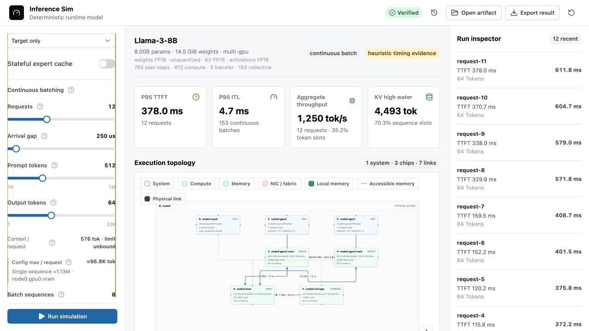

# inference-sim

A deterministic simulator for LLM inference placement, memory protocols, and
resource scheduling.

The project is intentionally split between exact protocol checks and calibrated
performance estimates. It can prove ledger and state-transition properties; it
does not claim hardware-accurate latency without calibration data.

**Live workbench:** [justinchuby.com/inference-sim](https://www.justinchuby.com/inference-sim/)

## What You Can Model

- Pick from 30 built-in model presets spanning 0.6B to 1T parameters and the
  main architecture families: dense GQA, fine-grained and coarse MoE, DeepSeek
  multi-head latent attention, Gemma-style local/global sliding-window hybrids,
  and Qwen3.6-style gated linear-attention hybrids. Every preset is derived
  from its published architecture and checked against the published parameter
  count.
- Nine of those presets are multimodal, covering the ways vision and audio
  actually attach to a decoder: ViT towers with a merging projector, an
  encoder-free stack that projects raw patches, a cross-attention adapter that
  adds no decoder tokens at all, and an encoder-decoder audio model. Each
  preset declares which modalities it accepts and what one item of each costs,
  because releases differ: the encoder-free Gemma-4 takes audio at 25 tokens a
  second while its MoE sibling has no audio stack at all, and Qwen2.5-VL bills
  twice as many temporal groups per second of video as Qwen3-VL. Choose
  text-only or one modality per run: a checkpoint served without media keeps
  its encoders resident but idle, while selecting a modality runs them and
  charges that modality's decoder tokens to the prompt.
- Five of the presets generate images rather than tokens, covering both
  denoiser families. A denoiser is not autoregressive: it caches no KV and runs
  once per denoising step, twice under classifier-free guidance, between the
  text towers that condition it and the latent decoder that ends the run.
  MMDiT stacks are uniform, while a UNet changes width and attention depth per
  resolution stage, so each stage is described and reported separately rather
  than averaged into one hidden size.
- Import local ONNX model packages directly in the browser, including external
  tensor data and onnx-genai inference metadata for multi-model pipelines.
- Inspect model size, parameter count, weight/activation dtype, quantization
  down to INT2/INT1, estimated FLOPs, active-weight traffic, and theoretical
  compute and bandwidth roofs.
- Build or edit one- to four-node device topologies with separate compute,
  VRAM/RAM/unified-memory/SSD domains, resource-manager capacity limits, and
  selectable PCIe, fabric, Ethernet, or RDMA links.
- Switching speculative decoding on reports what it bought, by simulating the
  same run without it and dividing. The acceptance behind it is declared, not
  predicted: nothing here knows what a proposer would agree with the target on,
  and prompt lookup in particular swings from excellent on editing to near
  useless on open generation, so the acceptance is reported beside the speedup
  rather than left to be mistaken for a measurement. The regime matters more
  than the proposer: a verification pass reads the weights once whatever its
  width, so on one Panther Lake stream the same acceptance is worth 2.6x, and
  at a batch of 64 it is worth 1.03x. Speculation and batching amortise the
  same weight read and do not stack.
- Machine presets check their own arithmetic. Peak memory bandwidth is not a
  free parameter but the transfer rate times the bus width, so each preset
  declares the bus beside the vendor's figure and the product has to agree
  within a percent. A preset that cannot be described consistently fails to
  build rather than quietly simulating a machine that does not exist. This is
  the same discipline the model presets already got from checking derived
  parameter counts against published ones.
- Simulate target-only and supported speculative decode families, continuous
  batching, chunked prefill, MoE placement and expert caching, TP/PP/EP/DP,
  multimodal pipelines, and optional SSD streaming.
- Run a sparse model that does not fit. With SSD streaming on, routed experts
  spill to storage while everything a token always touches stays resident, so
  a 109.5 GiB INT4 Qwen3-235B-A22B runs on a 64 GB Mac mini. It is timed
  honestly: the resident share of each token's routed reads is charged against
  memory and the rest against the storage link, and the hit rate comes from the
  model's declared routing skew rather than a flat expert count, so the run
  reports single-digit tokens per second instead of memory-bandwidth speed. A
  dense model has no expert to leave behind and still fails closed.
- Explore prompts up to 1M tokens and outputs up to 32K tokens with logarithmic
  controls. The workbench estimates the selected configuration's per-request
  and single-sequence context capacity from model KV geometry, model residency,
  placement, sharding, and user allocation limits.
- Serve several models from one device, which is what a personal machine
  actually does. Residency rather than compute is the binding constraint: each
  model holds its weights plus a preallocated KV arena, so the workload reports
  whether the working set fits or whether the device has to evict and reload,
  and what the swapping costs in time to first token.
- Inject a node fault into a set of concurrent executions and watch what a
  failed node actually does to work in flight: which operations it never ran,
  which ranks failed, aborted, or drained on surviving nodes, and whether
  quiescence came from survivors finishing or from the abort deadline.
- Read replay-verified latency, TTFT/ITL, throughput, memory pressure, resource
  utilization, roofline, topology, and confidence/provenance evidence; export
  the complete deterministic result and import it later for verification.

The browser workbench is a static application. Model files stay local and are
decoded and hashed in dedicated Web Workers; simulation does not require an
inference server or upload model data.



## Direction

The simulation model is being built around the onnx-genai memory and
distributed-runtime contracts. Planned scenarios cover:

- CPU-only;
- discrete GPU plus CPU;
- multi-GPU;
- GPU plus NPU;
- unified memory; and
- multi-node and heterogeneous execution.

Speculative decoding is a first-class workload model. It covers
prompt-lookup, draft-model, MTP, EAGLE-3, shared-KV, and self-speculative
proposers with target-authoritative verification and composite checkpoint
restore. Self-speculative is modeled as a design projection because the current
onnx-genai runtime does not expose it as a released proposer mode.

## Simulation Scale

Long-context inputs do not expand into one event per prompt token: chunked
prefill is represented as exact aggregate token work per scheduled batch.
Repeated stateless serving batches compile into immutable relative-time
topology templates, while request scheduling, batch membership, token
timestamps, KV accounting, and completion times remain exact. Aggregate
operation and utilization metrics multiply each template's reservations by its
exact occurrence count instead of rescanning duplicate plans.

The test suite includes a 1,048,576-token chunked prompt and a lossless 32,768
output-token trace. A 32-request by 4,096-output-token stress case (131,072
generated tokens) is also used during performance validation. Stateful MoE
residency, expert prefetch, SSD streaming, and shared physical-resource paths
are deliberately simulated batch by batch and are never accelerated by the
stateless template cache. Wall-clock runtime depends on the browser and host;
these workloads are correctness and scalability guards, not hardware latency
benchmarks.

## Development

### Setup

```bash
pnpm install --frozen-lockfile
pnpm build
pnpm test
```

Start the local workbench:

```bash
pnpm dev:web
```

The address bar carries the configuration, so a run can be shared by copying
the link. Only what differs from the defaults is written, which keeps a link
short and readable: `?scenario=panther-lake-x9-388h-32gb&model=gemma-4-e2b&batch=8`
says what it changes. A link is inputs rather than results, and whoever opens
it runs them. Imported files stay local: a custom topology, a local ONNX
package, a calibration dataset or a token trace cannot travel in a URL, and
Copy link says which of them it had to leave behind. Values are bounds-checked
on the way in, so an edited link cannot reach a state the controls could not
produce; anything unusable is reported and keeps its default rather than
discarding the rest of the link.

It opens on the simplest run that is still real: one INT4 Llama-3-8B on a Mac
mini, one request, one sequence per batch, prefilled in a single pass, with
speculation, expert caching and media all off. Every mechanism the simulator
models is then one switch away, which is easier to read than a default that
starts with several already interacting.

### Common CLI Workflows

List and inspect device scenarios:

```bash
pnpm sim presets
pnpm sim scenario multi-gpu-ring-4
pnpm sim scenario /path/to/custom-scenario.yaml
```

Inspect an ONNX model package and run static memory analysis:

```bash
pnpm sim onnx-inspect /path/to/model.onnx /path/to/manifest.json
pnpm sim static examples/mixtral-dgx-h100.yaml
```

Run serving, speculative decoding, and expert-cache workloads:

```bash
pnpm sim serving multi-gpu examples/serving.yaml
pnpm sim serving multi-gpu examples/serving-speculative.yaml
pnpm sim speculative examples/speculative-mtp.yaml
pnpm sim expert-cache examples/expert-cache.yaml
pnpm sim co-residency examples/co-residency.yaml
```

Compare topologies or exercise failure protocols:

```bash
pnpm sim serving-compare examples/serving-speculative.yaml
pnpm sim compare examples/target-only.yaml
pnpm sim fault-campaign multi-gpu examples/target-only.yaml
pnpm sim node-failover multi-node single-gpu-cpu examples/node-failover.yaml
```

Use `pnpm sim --help` for the complete command list.

### Calibration and Custom Scenarios

- `run`, `compare`, `serving`, `serving-compare`, and
  `fault-campaign` accept an optional final calibration path. Without one,
  they use the bundled heuristic cost model.
- The included calibration file is synthetic and remains heuristic. End-to-end
  confidence is the weakest confidence among the performance inputs actually
  used.
- Calibration revision 3 binds communication curves to an exact scenario,
  ordered link path, participant count, algorithm, optional AllToAllV traffic
  signature, and measured byte range. It never extrapolates silently.
- Commands that take one scenario accept a listed preset,
  `multi-gpu-ring-N` for `N=2..64`, or a revision-5 scenario YAML/JSON file.
  Custom scenarios pass the same strict validation used for embedded plans.
- `compare` and `serving-compare` retain the six fixed topology families so
  a custom target cannot silently change the comparison population.

### Formal Models

Protocol-level state machines live in the onnx-genai repository under
`specs/tla`. `KvAdmission.tla` models the continuous-batching KV pool and
exhaustively checks that the admission rule implemented in
`packages/core/src/serving.ts` keeps the pool deadlock-free.
`NodeFailure.tla` models node-fault quiescence and checks that a failed node
stops executing at the fault instant while surviving work still drains within
an explicit abort deadline. Both ship with a negative model that must violate
the property when the rule is removed, so a model cannot be silently weakened.

### Design Documentation

- [Simulator design and execution contracts](docs/DESIGN.md)
- [Producing and verifying onnx-genai runtime captures](docs/ONNX_GENAI_CAPTURE.md)

## License

MIT
